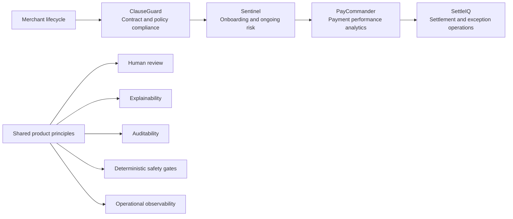

# Fintech AI Product Suite

Four portfolio-grade products spanning contract compliance, merchant risk, payment analytics, and settlement operations. The suite demonstrates how an AI product manager can move from a business problem to a working product, measurable decision logic, explainability, operational safeguards, and an interview-ready product narrative.

[](https://github.com/EngineeringEverday/fintech-ai-product-suite/actions/workflows/ci.yml)

## Product portfolio

| Product | Customer problem | Product and AI approach | Public demo | Source |
| --- | --- | --- | --- | --- |
| **ClauseGuard** | Legal, procurement, and security teams repeatedly review contracts against regulatory frameworks. | Three-stage clause extraction, compliance audit, and remediation workflow with human approval. | [Open demo](https://clauseguard-gamma.vercel.app) | [`clauseguard/`](clauseguard/) |
| **Sentinel** | Payments platforms need explainable merchant-risk decisions without overwhelming manual-review teams. | XGBoost risk scoring, SHAP explanations, deterministic compliance overrides, FastAPI, and a React risk-operations console. | [Open demo](https://merchant-risk-scoring.vercel.app) | [`merchant-risk-scoring/`](merchant-risk-scoring/) |
| **PayCommander** | Payment analysts lose time moving between warehouses, dashboards, and investigation tools. | Six-agent deterministic-first analytics pipeline with routing, validation, audit logging, and an observer portal. | [Open demo](https://paycommander.vercel.app) | [`paycommander/`](paycommander/) |
| **SettleIQ** | Settlement teams investigate payout status, reserves, chargebacks, and rail failures across siloed systems. | MCP-style skill routing, seven settlement domains, safety gates, and a reproducible synthetic operations environment. | [Open demo](https://settleiq.vercel.app) | [`settleiq/`](settleiq/) |

All four public portfolio endpoints are served through Vercel. The browser demos use deterministic or static fallbacks so they remain recruiter-friendly without credentials or paid model calls. The repositories include the fuller local implementations where applicable.

## How the suite fits together



The products are independent applications, but together they cover a coherent operating journey: contract review, merchant decisioning, transaction analytics, and post-transaction settlement.

## Architecture at a glance

| Project | Primary stack | Runtime model | Local depth beyond the public demo |
| --- | --- | --- | --- |
| ClauseGuard | React, TypeScript, Vite, Tailwind | Browser portfolio application | Configurable AI-assisted audit workflow and exportable review artifacts |
| Sentinel | Python, FastAPI, XGBoost, SHAP, React | Static Vercel demo with deterministic fallback | Training pipeline, real-time scoring API, SQLite logging, Docker, and model artifacts |
| PayCommander | Python, FastAPI, Streamlit, SQLite | Static deterministic Vercel demo | Six-agent pipeline, 100K-row mock warehouse, API, audit trail, and MIS reporting |
| SettleIQ | Python, Streamlit, SQLite | Static Vercel portfolio application | Six-agent orchestration, seven payment skills, generated settlement data, and local dashboard |

## Repository structure

```text
fintech-ai-product-suite/
├── .github/workflows/ci.yml
├── clauseguard/
├── merchant-risk-scoring/
├── paycommander/
├── settleiq/
└── README.md
```

Each product owns its documentation, dependencies, tests, deployment configuration, and local run instructions. Root-level CI coordinates the monorepo without coupling the application runtimes.

## Run locally

Use the product-specific README for complete instructions. These are the shortest entry points:

```bash
# ClauseGuard
cd clauseguard
npm ci
npm run dev

# Sentinel
cd merchant-risk-scoring
docker compose up --build

# PayCommander
cd paycommander
python -m venv .venv
source .venv/bin/activate
pip install -r requirements.txt
python run_local.py

# SettleIQ
cd settleiq
python -m venv .venv
source .venv/bin/activate
pip install -r requirements.txt
streamlit run dashboard/app.py
```

## Data, safety, and limitations

- All committed merchant, payment, settlement, risk, and compliance examples are synthetic or representative portfolio data.
- No production customer, employer, merchant, payer, or transaction records are included.
- Public demos favor deterministic behavior and reliability over external model calls.
- These applications are portfolio prototypes, not legal advice, underwriting decisions, or production financial controls.
- Local implementations demonstrate deeper system behavior than the static public surfaces.

## Continuous integration

The root workflow validates:

- ClauseGuard type-checking and production build
- Sentinel frontend build and Python tests
- PayCommander Python tests
- SettleIQ data generation, end-to-end demo execution, and Python compilation

## Repository scope

This public repository contains the code and technical documentation for these four related fintech applications. The private `Portfolio` repository remains the canonical home for cross-project descriptions, comparisons, interview positioning, and the complete project catalog.
