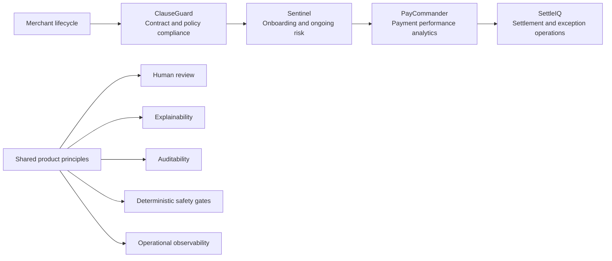

# AI Projects

Nine portfolio-grade AI products spanning product discovery, document intelligence, customer feedback, contract compliance, merchant operations, risk, payment analytics, network intelligence, and settlement operations. The collection demonstrates how an AI product manager can move from a business problem to a working product, measurable decision logic, explainability, operational safeguards, and an interview-ready product narrative.

[](https://github.com/EngineeringEverday/AI-Projects/actions/workflows/ci.yml)

## Product portfolio

| Product | Customer problem | Product and AI approach | Public demo | Source |
| --- | --- | --- | --- | --- |
| **ClauseGuard** | Legal, procurement, and security teams repeatedly review contracts against regulatory frameworks. | Three-stage clause extraction, compliance audit, and remediation workflow with human approval. | [Open demo](https://clauseguard-gamma.vercel.app) | [`clauseguard/`](clauseguard/) |
| **Sentinel** | Payments platforms need explainable merchant-risk decisions without overwhelming manual-review teams. | XGBoost risk scoring, SHAP explanations, deterministic compliance overrides, FastAPI, and a React risk-operations console. | [Open demo](https://merchant-risk-scoring.vercel.app) | [`merchant-risk-scoring/`](merchant-risk-scoring/) |
| **PayCommander** | Payment analysts lose time moving between warehouses, dashboards, and investigation tools. | Six-agent deterministic-first analytics pipeline with routing, validation, audit logging, and an observer portal. | [Open demo](https://paycommander.vercel.app) | [`paycommander/`](paycommander/) |
| **SettleIQ** | Settlement teams investigate payout status, reserves, chargebacks, and rail failures across siloed systems. | MCP-style skill routing, seven settlement domains, safety gates, and a reproducible synthetic operations environment. | [Open demo](https://settleiq.vercel.app) | [`settleiq/`](settleiq/) |
| **MerchVault** | Payments operations teams need one place to review merchant compliance, risk, documents, and support history. | Next.js merchant-intelligence console covering KYC, UBO screening, risk tiering, audit trails, and communications. | [Open demo](https://merchvault-snowy.vercel.app) | [`merchvault/`](merchvault/) |
| **GraphLens / OpenCMS Payments** | Analysts need to understand complex financial relationships in CMS Open Payments data. | Svelte, FastAPI, and graph analytics for temporal networks, communities, anomalies, and interactive investigation. | [Open demo](https://open-cms-payments.vercel.app) | [`open-cms-payments/`](open-cms-payments/) |
| **InsightDraft** | Product teams need to convert raw research into grounded, reviewable product requirements. | Multi-agent research, synthesis, and strategy workflow with confidence UX and human review. | [Open demo](https://insightdraft.vercel.app) | [`insightdraft/`](insightdraft/) |
| **KYB Donut** | Fintech onboarding teams need structured, validated data from complex merchant documents. | OCR-free document understanding with deterministic validation, confidence thresholds, and review routing. | [Open demo](https://kyb-donut.vercel.app) | [`kyb-donut/`](kyb-donut/) |
| **SignalMap** | Product teams need to turn unstructured customer reviews into prioritized product intelligence. | Multi-agent semantic clustering, sentiment analysis, trend detection, and action recommendations. | [Open demo](https://signalmap.vercel.app) | [`signalmap/`](signalmap/) |

All nine public portfolio endpoints are served through Vercel. The browser demos use deterministic or static fallbacks where applicable so they remain recruiter-friendly without credentials or paid model calls. The repository includes the fuller local implementations.

## How the suite fits together



The four core fintech workflow products cover a coherent operating journey: contract review, merchant decisioning, transaction analytics, and post-transaction settlement. MerchVault adds the merchant-operations control plane, while GraphLens demonstrates network-level payment analysis. InsightDraft, KYB Donut, and SignalMap broaden the collection into product discovery, document AI, and customer intelligence.

## Architecture at a glance

| Project | Primary stack | Runtime model | Local depth beyond the public demo |
| --- | --- | --- | --- |
| ClauseGuard | React, TypeScript, Vite, Tailwind | Browser portfolio application | Configurable AI-assisted audit workflow and exportable review artifacts |
| Sentinel | Python, FastAPI, XGBoost, SHAP, React | Static Vercel demo with deterministic fallback | Training pipeline, real-time scoring API, SQLite logging, Docker, and model artifacts |
| PayCommander | Python, FastAPI, Streamlit, SQLite | Static deterministic Vercel demo | Six-agent pipeline, 100K-row mock warehouse, API, audit trail, and MIS reporting |
| SettleIQ | Python, Streamlit, SQLite | Static Vercel portfolio application | Six-agent orchestration, seven payment skills, generated settlement data, and local dashboard |
| MerchVault | Next.js, TypeScript, Tailwind | Vercel application | Merchant compliance, risk, document, audit, and support workflows |
| GraphLens / OpenCMS Payments | Svelte, Vite, FastAPI, graph analytics | Static Vercel frontend | Python API, temporal graph construction, anomaly analysis, and processed public data |
| InsightDraft | React, TypeScript, Vite, multi-agent LLM workflow | Static Vercel application | Research synthesis, confidence UX, evidence traceability, and human review |
| KYB Donut | React, FastAPI, Celery, Donut | Static Vercel frontend | Document-AI inference, validation, batch processing, analytics, and feedback workflows |
| SignalMap | React, TypeScript, Vite, multi-agent LLM workflow | Static Vercel application | Semantic review clustering, sentiment timelines, synthesis, triage, and export |

## Repository structure

```text
AI-Projects/
├── .github/workflows/ci.yml
├── clauseguard/
├── insightdraft/
├── kyb-donut/
├── merchant-risk-scoring/
├── merchvault/
├── open-cms-payments/
├── paycommander/
├── signalmap/
├── settleiq/
└── README.md
```

Each product owns its documentation, dependencies, tests, deployment configuration, and local run instructions. Root-level CI coordinates the monorepo without coupling the application runtimes.

## Run locally

Use the product-specific README for complete instructions. These are the shortest entry points:

```bash
# ClauseGuard
cd clauseguard
npm ci
npm run dev

# Sentinel
cd merchant-risk-scoring
docker compose up --build

# PayCommander
cd paycommander
python -m venv .venv
source .venv/bin/activate
pip install -r requirements.txt
python run_local.py

# SettleIQ
cd settleiq
python -m venv .venv
source .venv/bin/activate
pip install -r requirements.txt
streamlit run dashboard/app.py

# MerchVault
cd merchvault
npm ci
npm run dev

# GraphLens / OpenCMS Payments frontend
cd open-cms-payments/frontend
npm ci
npm run dev

# InsightDraft
cd insightdraft
npm ci
npm run dev

# KYB Donut frontend
cd kyb-donut/frontend
npm ci
npm run dev

# SignalMap
cd signalmap
npm ci
npm run dev
```

## Data, safety, and limitations

- All committed merchant, payment, settlement, risk, and compliance examples are synthetic or representative portfolio data.
- No production customer, employer, merchant, payer, or transaction records are included.
- Public demos favor deterministic behavior and reliability over external model calls.
- These applications are portfolio prototypes, not legal advice, underwriting decisions, or production financial controls.
- Local implementations demonstrate deeper system behavior than the static public surfaces.

## Continuous integration

The root workflow validates:

- ClauseGuard type-checking and production build
- Sentinel frontend build and Python tests
- PayCommander Python tests
- SettleIQ data generation, end-to-end demo execution, and Python compilation
- MerchVault production build
- GraphLens / OpenCMS Payments frontend build
- InsightDraft production build
- KYB Donut frontend type-check and production build
- SignalMap production build

## Repository scope

This public repository contains the code and technical documentation for all nine AI product applications. The private `Portfolio` repository remains the canonical home for cross-project descriptions, comparisons, interview positioning, and the complete project catalog.
