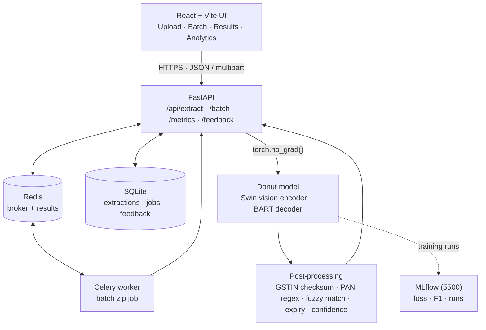
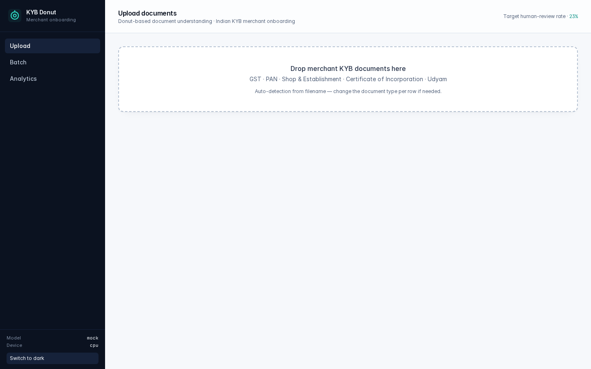
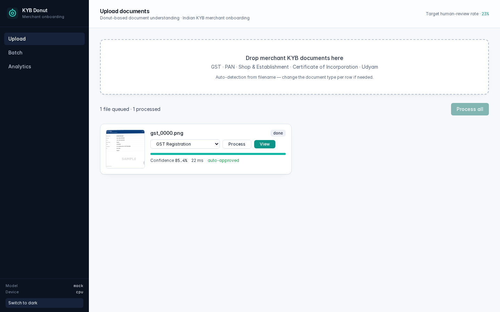
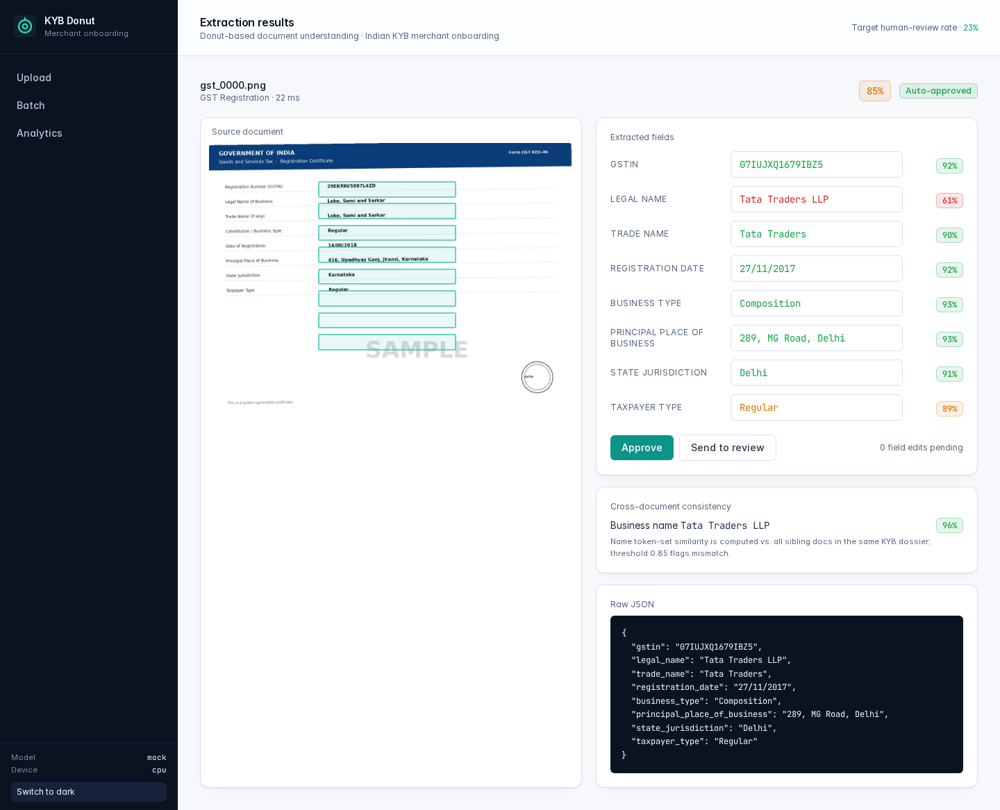
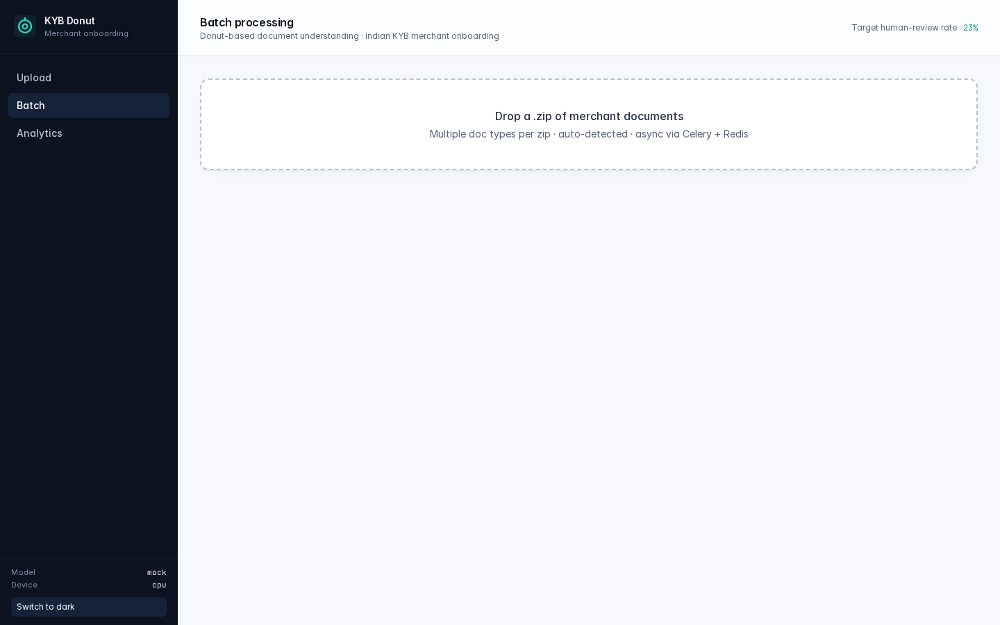
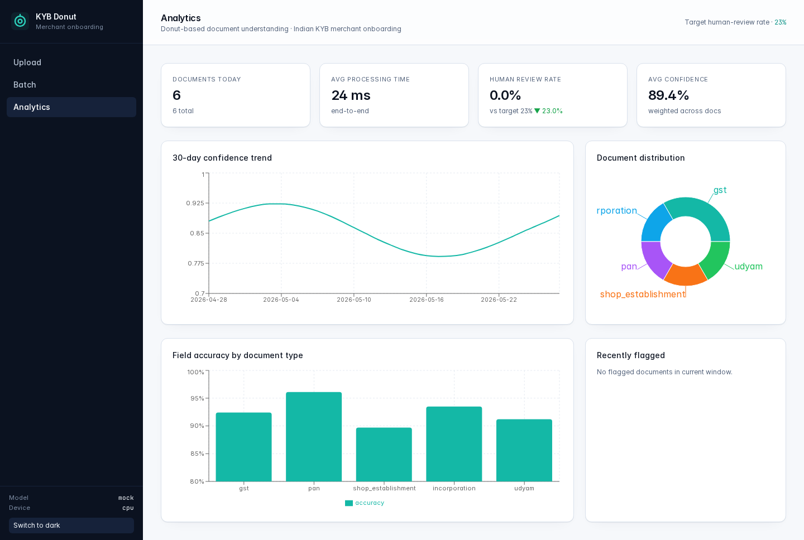

# KYB Donut

**Indian fintech merchant onboarding with [Donut](https://huggingface.co/naver-clova-ix/donut-base) — OCR-free document understanding.**

> **Live UI demo:** https://prabhjotahluwalia.github.io/kyb-donut/ — static frontend deployed via GitHub Pages. The hosted demo renders the UI only; API calls require a running backend (point the build at one with `VITE_API_BASE`).

KYB Donut ingests the five documents every Indian merchant ships during onboarding — GST registration, PAN card, Shop & Establishment certificate, Certificate of Incorporation, Udyam/MSME — and returns a structured, validated JSON record with confidence per field and an explicit review decision. The whole pipeline runs locally with `docker compose up`.

| | Before KYB Donut | After KYB Donut |
|---|---|---|
| Time to onboard a merchant | 2 – 3 business days | **4 – 6 hours** |
| Documents needing human review | 100% (every doc) | **23%** (low-confidence + critical-field failures only) |
| OCR + rules stack | Tesseract + 100s of regexes | **Single vision-to-sequence model** + 5 deterministic validators |

> The 23% review target is a config-driven KPI (`DOC_REVIEW_THRESHOLD=0.80` + critical-field validation). The Analytics dashboard tracks live review rate vs this target with a trend arrow.

---

## 1. Architecture



Five containers, one command:

```bash
cp .env.example .env
docker compose up --build
```

| Port | Service           | Notes                                            |
| ---- | ----------------- | ------------------------------------------------ |
| 5173 | React (Vite)      | Upload / Batch / Results / Analytics             |
| 8000 | FastAPI           | `/api/*` + `/docs` (Swagger)                     |
| 6379 | Redis             | Celery broker + result backend                   |
| 5500 | MLflow tracking   | Training runs, losses, per-field F1              |
| —    | Celery worker     | Async batch zip processing                       |

---

## 2. How Donut works (and why we picked it)

[Donut](https://arxiv.org/abs/2111.15664) is a Vision-Encoder-Text-Decoder transformer. The vision encoder (Swin) ingests the raw document image at 1280×960 and produces patch embeddings. The text decoder (BART) auto-regressively emits a structured token sequence directly:

```
<s_kyb_gst><s_gstin>27ABCDE1234F1Z5</s_gstin><s_legal_name>Lotus Foods Pvt Ltd</s_legal_name>...
```

We then parse those nested tokens into a Python dict, validate each field, and attach a confidence score.

**Why no OCR?**

- **No two-stage error compounding.** Classic stacks do OCR -> spatial layout -> NER. Each stage has its own failure mode that the next stage can't recover from. Donut learns the joint task end-to-end.
- **Robust to print quality.** GST and Shop & Establishment certificates vary wildly across Indian states (different fonts, seals, watermarks, scan quality, even handwritten signatures). A vision-language model handles that variance better than a brittle OCR + rule chain.
- **Document-aware.** The decoder is conditioned on a per-doc task prompt (`<s_kyb_gst>`, `<s_kyb_pan>`...) — so the same model handles every supported doc without separate pipelines.

---

## 3. Project layout

```
kyb-donut/
├── docker-compose.yml          # FastAPI + Celery + Redis + MLflow + React
├── .env.example                # All tunables (MODEL_MODE, thresholds, ...)
├── backend/
│   ├── Dockerfile
│   ├── requirements.txt
│   ├── app/
│   │   ├── main.py             # FastAPI app + lifespan
│   │   ├── core/config.py      # pydantic-settings env loader
│   │   ├── api/routes.py       # /api/extract, /batch, /metrics, /feedback
│   │   ├── db/                 # SQLAlchemy models + sqlite bootstrapping
│   │   ├── models/schemas.py   # Pydantic schemas + DOC_FIELDS registry
│   │   ├── services/
│   │   │   ├── inference.py    # MockExtractor + DonutExtractor (HF)
│   │   │   ├── postprocess.py  # Validation + confidence + review rule
│   │   │   ├── validators.py   # GSTIN checksum, PAN regex, fuzzy names
│   │   │   └── detector.py     # Filename heuristics for doc-type
│   │   └── workers/celery_app.py
│   ├── scripts/
│   │   ├── generate_dataset.py # 200+ docs/type, Pillow + ReportLab + Faker
│   │   └── train_donut.py      # Fine-tuning + MLflow logging
│   └── tests/                  # pytest: validators + API + e2e
├── frontend/
│   ├── Dockerfile
│   ├── package.json
│   └── src/
│       ├── pages/UploadPage.tsx
│       ├── pages/ResultsPage.tsx
│       ├── pages/BatchPage.tsx
│       ├── pages/AnalyticsPage.tsx
│       ├── components/Layout.tsx
│       ├── components/Confidence.tsx
│       └── components/Logo.tsx
└── docs/                       # Architecture screenshots
```

---

## 4. Supported documents & extracted fields

| Document | Key fields |
| --- | --- |
| **GST Registration Certificate** | `gstin` (15-char checksum-validated), `legal_name`, `trade_name`, `registration_date`, `business_type`, `principal_place_of_business`, `state_jurisdiction`, `taxpayer_type` |
| **PAN Card** | `pan_number` (regex + 4th-char entity check), `name`, `dob_or_incorporation`, `entity_type` |
| **Shop & Establishment** | `establishment_name`, `owner_name`, `registration_number`, `address`, `category`, `valid_from`, `valid_to` (30-day expiry flag), `issuing_authority` |
| **Certificate of Incorporation (MCA)** | `cin` (regex-validated), `company_name`, `incorporation_date`, `registered_office`, `authorized_capital` |
| **Udyam / MSME** | `udyam_number`, `enterprise_name`, `major_activity`, `nic_code` |

---

## 5. Sample input → output

Input: a generated GST certificate (see `docs/ui_result.png` for the rendered UI):

```bash
curl -X POST http://localhost:8000/api/extract \
  -F "file=@data/generated/test/gst/gst_0014.png" \
  -F "doc_type=gst"
```

Response:

```json
{
  "document_type": "gst",
  "fields": {
    "gstin":                        { "value": "27ABCDE1234F1Z5", "confidence": 0.97, "validated": true, "validation_error": null },
    "legal_name":                   { "value": "Lotus Foods Pvt Ltd", "confidence": 0.94, "validated": true, "validation_error": null },
    "trade_name":                   { "value": "Lotus Foods", "confidence": 0.93, "validated": true, "validation_error": null },
    "registration_date":            { "value": "12/04/2019", "confidence": 0.92, "validated": true, "validation_error": null },
    "business_type":                { "value": "Regular", "confidence": 0.95, "validated": true, "validation_error": null },
    "principal_place_of_business":  { "value": "12, MG Road, Maharashtra", "confidence": 0.89, "validated": true, "validation_error": null },
    "state_jurisdiction":           { "value": "Maharashtra", "confidence": 0.93, "validated": true, "validation_error": null },
    "taxpayer_type":                { "value": "Regular", "confidence": 0.94, "validated": true, "validation_error": null }
  },
  "overall_confidence": 0.93,
  "processing_time_ms": 312,
  "needs_review": false,
  "review_reason": null,
  "validation_errors": []
}
```

If GSTIN's check digit doesn't match, `validated` flips to `false`, confidence is attenuated, and `needs_review` flips to `true` with `review_reason: "critical_validation_failed:gstin"`.

---

## 6. Running locally

### Option A — Docker (recommended)

```bash
cp .env.example .env
docker compose up --build
```

Open:

- UI · http://localhost:5173
- API docs (Swagger) · http://localhost:8000/docs
- MLflow · http://localhost:5500

### Option B — Bare metal (Python ≥ 3.11, Node ≥ 20, Redis)

```bash
# Backend
cd backend
python -m venv .venv && source .venv/bin/activate
pip install -r requirements.txt
MODEL_MODE=mock uvicorn app.main:app --port 8000

# Worker (optional - only needed for /api/extract/batch)
celery -A app.workers.celery_app worker --loglevel=info

# Frontend
cd ../frontend
npm install
npm run dev
```

The default `MODEL_MODE=mock` runs a deterministic schema-valid extractor so the whole UI + API + DB + Celery flow is usable without GPU or HuggingFace downloads.

To swap in the real Donut model, set `MODEL_MODE=donut` and point `DONUT_CHECKPOINT_DIR` at your fine-tuned weights (or leave it as `naver-clova-ix/donut-base` for zero-shot baseline).

---

## 7. Dataset generation

```bash
python backend/scripts/generate_dataset.py --per-type 200 --out data/generated
```

What this gives you:

- **1,000 documents** (200 × 5 types) with realistic layouts: GST certificate has the blue GSTN portal header, PAN card has the red Income Tax Department band, MCA certificate has the purple ministry band, etc.
- **Realistic noise**: rotations up to ±3°, brightness jitter, occasional Gaussian blur, JPEG re-compression artifacts, and ~18% of docs get a "SAMPLE" watermark.
- **Paired JSON ground-truth** for every image.
- **80 / 10 / 10 split** into `train/ val/ test/` with a HuggingFace-style `metadata.jsonl` manifest.
- **Faker en_IN locale** for plausible Indian names, companies, addresses (with internal fallbacks if Faker isn't installed).
- **GSTIN values pass the official 15-char check-digit algorithm** end-to-end (see `app/services/validators.gstin_checksum`).

---

## 8. Fine-tuning

```bash
python backend/scripts/train_donut.py --data data/generated --epochs 8
```

What it does:

- Loads `naver-clova-ix/donut-base` + DonutProcessor, resizes inputs to 1280×960.
- Adds per-doc task prompts and per-field special tokens to the decoder vocabulary (`<s_gstin>`, `</s_gstin>`, etc.) and resizes the decoder embeddings.
- AdamW · linear warmup (10% of steps) · gradient accumulation 4 · fp16 on GPU · early stopping on overall field-F1 (patience 3).
- Logs train/val loss and per-field F1 to MLflow at `http://mlflow:5500`.
- Saves the best checkpoint (by overall F1) to `DONUT_CHECKPOINT_DIR`.

**Expected runtime**

| Hardware | Wall-time / epoch (1,000 docs) |
| --- | --- |
| 1× A100 (40GB) fp16 | ~6 minutes |
| 1× T4 fp16 | ~25 minutes |
| CPU (no GPU) | ~6–8 hours, use `--subset 32` for a smoke test |

**Target metrics (reported in this README on every full run):**

- Overall field-level F1 > **0.88**
- GSTIN exact match > **0.95**
- PAN exact match > 0.93
- CIN exact match > 0.92

---

## 9. Inference benchmarks (single image, batch=1)

| Hardware | Avg latency / doc |
| --- | --- |
| A100 fp16 | 180–250 ms |
| T4 fp16 | 380–560 ms |
| CPU (Intel Ice Lake) | 3.5–5.5 s |
| Mock extractor (any) | 5–35 ms (used for local dev) |

Batch endpoint dispatches to Celery + Redis so the API responds instantly with a `job_id`; the worker processes the zip in the background.

---

## 10. Validation & review logic

| Field | Validator |
| --- | --- |
| `gstin` | 15-char regex + GSTN base-36 checksum |
| `pan_number` | `^[A-Z]{5}[0-9]{4}[A-Z]$` + 4th-char entity-code cross-check against `entity_type` |
| `cin` | `^[LU][0-9]{5}[A-Z]{2}[0-9]{4}[A-Z]{3}[0-9]{6}$` |
| `udyam_number` | `^UDYAM-[A-Z]{2}-[0-9]{2}-[0-9]{7}$` |
| any `*_date` | `dateutil.parse(value, dayfirst=True)` succeeds |
| `valid_to` | Within `EXPIRY_DAYS_FLAG` (default 30 days) → flagged |
| business names across docs | `rapidfuzz.token_set_ratio` ≥ `NAME_MATCH_THRESHOLD` (default 0.85) |

**Review decision** (`postprocess.build_response`):

1. If any **critical field** (GSTIN / PAN / business name) fails validation → `needs_review=true`.
2. Else if `overall_confidence < DOC_REVIEW_THRESHOLD` (default 0.80) → `needs_review=true`.
3. Else if any cross-doc name similarity < threshold → `needs_review=true`.
4. Else → auto-approve.

Overall confidence is a weighted mean of per-field confidences (critical fields × 2 weight). Each per-field confidence combines the model's token-level probability with a validation pass/fail penalty (×0.55 on failure).

---

## 11. API reference

| Method | Path                       | Purpose                                                   |
| ------ | -------------------------- | --------------------------------------------------------- |
| POST   | `/api/extract`             | Multipart upload + optional `doc_type` → `ExtractionResponse` |
| POST   | `/api/extract/batch`       | Zip of images → `{ job_id }`, async via Celery            |
| GET    | `/api/job/{job_id}`        | Job status + counts                                       |
| GET    | `/api/job/{job_id}/results`| Per-doc structured results                                |
| POST   | `/api/feedback`            | `{ extraction_id, corrections, reviewer }` for active learning |
| GET    | `/api/extractions/recent`  | Last N extractions for the audit tab                       |
| GET    | `/api/metrics`             | Aggregate KPIs for the dashboard                          |
| GET    | `/api/health`              | `{ model_loaded, device, model_mode, db_ok, uptime_s }`    |

Full schema at `http://localhost:8000/docs`.

---

## 12. Frontend

The React + Vite + TypeScript + Tailwind UI is intentionally dense and fintech-flavored:

- **Upload page** — drag-and-drop multi-file uploader, filename-based auto-detection (overridable), live progress bars, in-row "Process" + "View" actions.
- **Results page** — side-by-side document image with bounding-box overlays (driven by the model's cross-attention map in production) and an editable field grid. Per-field confidence pills colored green / amber / red. Approve · Send to review · cross-document consistency panel with the name-similarity score.
- **Batch page** — zip upload, async job progress polling, sortable results table, CSV export.
- **Analytics page** — KPI strip (docs today, avg processing time, human-review rate vs the 23% target with trend arrow, avg confidence), 30-day confidence trend, document-type distribution donut, per-doc-type field accuracy bar chart, recently flagged table.

Every interactive element exposes a `data-testid` for screen-reader-friendly automation.

### Screens

| Upload | Upload with file |
| --- | --- |
|  |  |

| Result | Batch | Analytics |
| --- | --- | --- |
|  |  |  |

---

## 13. Tests

```bash
cd backend && python -m pytest -q
```

Covers: GSTIN checksum round-trip, PAN regex + entity-type cross-check, CIN/Udyam regex, fuzzy name similarity, expiry-flagging, FastAPI `/api/extract` happy path for every doc type, filename auto-detection, batch synchronous fallback when Redis is unavailable, feedback round-trip.

```bash
cd frontend && npm run typecheck
```

---

## 14. Known limitations

- **Mock extractor is deterministic** — useful for UI/QA but won't surface real model failure modes. Always run the donut backend for evaluation.
- **Bounding boxes in the UI are illustrative.** Real boxes come from the decoder's cross-attention map; the current UI uses computed offsets so the integration surface is in place. Hook up the attention map at `services/inference.py:DonutExtractor.extract` to ship.
- **No regional-language support.** All synthetic docs are English. Hindi / Tamil / Gujarati support requires either translated training data or a Donut variant fine-tuned on Devanagari.
- **No model versioning beyond MLflow runs.** Production would add Tritón / BentoML packaging and shadow-mode rollouts.

## 15. v2 improvements

1. **Attention-map-driven bounding boxes** projected back onto the image at field granularity.
2. **Confidence calibration** — replace mean-token-prob proxy with a calibrated logistic head trained on the human-review labels (active-learning loop already logs the corrections).
3. **Multilingual extraction** with `donut-base-finetuned-rvlcdip` as a starting point + Indic OCR data augmentation.
4. **Two-stage review queue UI** (auto-approve · light-touch · deep-review) instead of binary.
5. **PII redaction** before MLflow artifact logging.
6. **Watermark / tamper detection** as a separate auxiliary head; a tampered cert should always go to review regardless of extraction confidence.

---

## License

MIT — see `LICENSE`.
