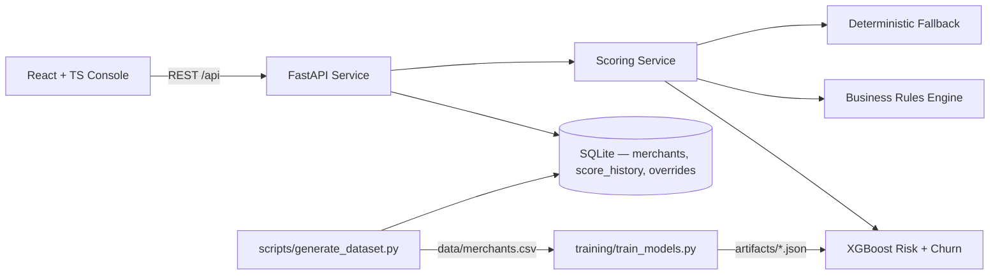

# Sentinel — Merchant Risk Scoring


Portfolio-grade merchant risk platform for an Indian payments aggregator in the Paytm / Razorpay / PhonePe class. It combines synthetic payments-risk data engineering, XGBoost model training, SHAP explainability, deterministic compliance overrides, a real-time FastAPI scoring service, and a React + TypeScript risk-ops dashboard.

Built to demonstrate senior PM and ML product judgment: the system turns manual, rule-based merchant review into an explainable risk decisioning workflow for high-volume transaction approval and onboarding.

**Full live demo:** https://sentinel-merchant-risk.pplx.app  
**GitHub Pages static demo:** https://prabhjotahluwalia.github.io/merchant-risk-scoring/  
**Source:** https://github.com/EngineeringEverday/fintech/tree/main/merchant-risk-scoring

The `pplx.app` deployment runs the FastAPI backend. The GitHub Pages deployment is a static portfolio demo and intentionally uses the frontend's deterministic mock fallback because GitHub Pages cannot run Python/FastAPI services.

> **Risk vs. churn.** The headline label here is **risk** — the probability of financial loss to the platform from chargebacks, fraud, or regulatory/compliance violations. Churn propensity is a secondary, exploratory model shipped alongside, not the primary decision signal.

---

## Portfolio Highlights

- **End-to-end ML product** — 50K-row synthetic merchant dataset, feature engineering, XGBoost risk/churn models, Optuna tuning hooks, MLflow logging hooks, model artifacts, and model card.
- **Explainable real-time API** — `/api/score` returns a 0–100 risk score, tier, recommended action, churn probability, top SHAP drivers, and any business-rule overrides.
- **Risk-ops dashboard** — merchant lookup, Merchant 360, portfolio risk monitoring, SHAP/model explainability, impact metrics, and simulated score history.
- **Compliance-aware rules layer** — deterministic overrides for prohibited MCCs, high dispute rates, weak KYB, and new-merchant risk premiums, with every override logged to SQLite.
- **Runnable portfolio repo** — `docker-compose up --build` starts the FastAPI backend and React/Nginx frontend with generated demo data and quick model artifacts.

> **Synthetic data notice.** All sample merchant records, risk labels, AML/RBI flags, dispute behavior, chargebacks, and churn outcomes in this repository are fully synthetic and generated by `scripts/generate_dataset.py`. The committed CSV exists only so the portfolio demo runs immediately; it contains no real merchants, payers, patients, customers, or production payments data.

---

## Business Impact (modeled)

| Metric | Baseline (rules-only) | With Sentinel | Δ |
| --- | --- | --- | --- |
| Chargeback losses | 100 (idx) | 40 | **−60%** |
| Manual review queue share | 100% | 38% | **−62 pp** |
| Legitimate high-volume merchant approvals | 100 (idx) | 134 | **+34%** |

Score → action mapping enforced by the API:

| Score | Tier | Action |
| --- | --- | --- |
| 0–30 | Low | Auto-approve |
| 31–55 | Medium | Enhanced monitoring; hold transactions > ₹1L |
| 56–75 | High | Manual review |
| 76–100 | Critical | Block + compliance escalation |

---

## Architecture



Two-process layout: `api` (FastAPI / Uvicorn, port 8000) and `web` (Vite-built static frontend served by Nginx on port 5173, with `/api` proxied to the backend). Both spin up with one `docker-compose up`.

---

## Quickstart

```bash
# 1. Spin everything up (~3 min on first build — trains a quick model inside the image)
docker-compose up --build

# 2. Open the console
open http://localhost:5173

# 3. Or hit the API directly
curl http://localhost:8000/api/health
curl -X POST http://localhost:8000/api/score \
  -H 'Content-Type: application/json' \
  -d '{
    "merchant_id":"MID-DEMO-001","business_name":"Acme Retail",
    "mcc":"5411","gmv_monthly_inr":4500000,"dispute_rate":0.012,
    "refund_rate":0.03,"chargeback_count":2,"kyb_score":0.78,"kyb_status":"verified",
    "vintage_days":420,"city":"Mumbai","aml_alerts_30d":0,"rbi_flags_count":0
  }'
```

### Docker troubleshooting

If the web UI opens but API-backed data does not load, check the backend health endpoint first:

```bash
curl http://localhost:8000/api/health
```

The Docker setup intentionally does **not** bind-mount `./data` or `./artifacts` into the API container. The image generates quick demo artifacts during build, and bind mounts can accidentally hide those files on a fresh unzip/clone if Docker creates empty host folders. For local experimentation, run the non-Docker commands below, which write directly into `data/` and `artifacts/`.

### Local dev without Docker

```bash
# Backend
pip install -r requirements.txt
python scripts/generate_dataset.py --quick
python training/train_models.py --quick
uvicorn app.main:app --reload --port 8000

# Frontend
cd frontend && npm install && npm run dev
```

---

## What's Inside

```
merchant-risk-scoring/
├── scripts/generate_dataset.py     # 50K-row generator (--quick = 5K) with MCC→LOB map, 65/25/10 risk mix
├── training/train_models.py        # XGBoost + Optuna (50 trials; --quick = 5) + native pred_contribs SHAP + MLflow
├── app/                            # FastAPI service
│   ├── main.py                     #   - lifespan loads artifacts, seeds SQLite
│   ├── schemas.py                  #   - pydantic request/response models
│   ├── db.py                       #   - SQLite: merchants, score_history, overrides
│   ├── services/scoring.py         #   - ModelBundle, score_one, calibrated prediction + fallback
│   ├── services/rules.py           #   - 4 deterministic business rules
│   └── routers/                    #   - scoring, model, merchants, dashboard
├── frontend/                       # React 18 + TS + Tailwind + Recharts
│   ├── src/pages/Lookup.tsx        #   - merchant scoring form (presets + manual)
│   ├── src/pages/Merchant360.tsx   #   - 90-day trend, drivers, history
│   ├── src/pages/Dashboard.tsx     #   - KPIs, impact card, tier dist, scatter, top-20
│   ├── src/pages/ModelPage.tsx     #   - global SHAP, confusion matrix, model card
│   └── src/lib/mockApi.ts          #   - in-browser scoring mirror for static preview
├── tests/                          # 19 pytest tests covering dataset, rules, API
├── notebooks/merchant_risk_eda_modeling.ipynb
├── artifacts/                      # generated: risk_model.json, churn_model.json, SHAP plots, metrics.json, model_card.md
├── data/merchants.csv              # generated synthetic dataset
├── Dockerfile + frontend/Dockerfile + docker-compose.yml
└── .pre-commit-config.yaml         # ruff + pytest
```

---

## Why XGBoost (and not LightGBM or a neural net)?

For a structured-tabular problem at this scale (~50K merchants, ~30 features, mixed numeric + low-cardinality categorical):

- **XGBoost vs. LightGBM** — XGBoost wins on production maturity. LightGBM is marginally faster to train but XGBoost has a more stable model format across versions, broader cloud deployment recipes (SageMaker, Vertex, etc.), and a native `pred_contribs=True` SHAP API that doesn't require the heavier `shap` library at serve time.
- **XGBoost vs. neural networks** — Gradient-boosted trees consistently outperform deep learning on tabular data below ~1M rows (see Borisov et al., 2022; Grinsztajn et al., 2022). They also serve in <5ms on a single CPU core, which matters when scoring decisions must complete inline with merchant onboarding.
- **Calibration.** Trees produce well-ranked but miscalibrated probabilities by default. We layer **isotonic regression** on a held-out fold so the predicted P(High risk) can be trusted as a probability — necessary for the score-to-tier cutoffs (0-30/31-55/56-75/76-100) to be meaningful.

---

## How SHAP Powers Explainability (in plain English)

For every merchant that gets a score, the API returns the five features that most pushed the score up or down. Think of it as: *"Of the +43 points this merchant scored on risk, +18 came from a 2.4% dispute rate, +9 from being only 22 days old, and +6 from an MCC commonly seen in chargeback abuse. −4 came from a clean AML record."*

This isn't a post-hoc rationalization — it's a mathematically faithful decomposition (Tree SHAP) of the model's prediction into per-feature contributions. The compliance team can defend any held/blocked merchant decision in regulatory audit, and the relationship team can tell a borderline merchant exactly which document or metric to improve to clear review.

---

## Business Rules (always applied, deterministic, overrideable)

| Rule | Trigger | Action |
| --- | --- | --- |
| Prohibited MCC | `mcc == "7995"` (gambling) | Force tier = Critical, compliance flag |
| High dispute rate | `dispute_rate > 0.05` | Force tier ≥ High |
| Weak KYB | `kyb_score < 0.3` | Force manual review |
| New merchant | `vintage_days < 30` | Add +10 to score, flag for monitoring |

Rules run **after** the model, so a regulator-mandated block is never softened by a "low risk" model output. Every override is logged with reason + timestamp in the SQLite `overrides` table and surfaced on the score-history view.

---

## API Reference

| Method | Path | Purpose |
| --- | --- | --- |
| `GET` | `/api/health` | Liveness + model load state |
| `POST` | `/api/score` | Score a merchant payload, return tier + drivers |
| `GET` | `/api/merchants/{id}` | Merchant 360 — last 90 days, score history, overrides |
| `GET` | `/api/dashboard/summary` | KPIs, tier distribution, top-20 risky merchants |
| `GET` | `/api/model/metadata` | Trained-model metrics, feature importance, model card |
| `GET` | `/api/model/card` | Markdown model card (raw) |

Interactive docs at `http://localhost:8000/docs` when the API is running.

---

## Tests

```bash
pytest -q              # 19 tests covering dataset shape, rule semantics, API smoke
ruff check .            # lint
pre-commit run --all-files
```

---

## Limitations

- **Synthetic data.** The generator is calibrated against published Indian payments benchmarks (RBI reports, dispute-rate disclosures), but real production traffic will show MCC-specific adversarial patterns no synthetic generator captures. Plan a 30-day shadow-mode rollout before any auto-block decisioning is enabled.
- **Class imbalance is modest by design** — the 65/25/10 mix is realistic but production data is usually 90/8/2. Re-train on real data and rebalance with focal loss or scale_pos_weight before promotion.
- **Calibration drift.** Isotonic calibration is fit once; in production, re-fit weekly on the last 90 days of labels.
- **Single point-in-time view.** Velocity features (txns/hr, geo-mismatch counts) are out of scope here — see v2 below.

---

## v2 Roadmap

- **Velocity features** — transactions-per-hour, geo-mismatch counts, terminal-fingerprint reuse
- **Graph features** — shared bank account / device fingerprint across merchants (community detection on a merchant-link graph)
- **LLM signal for KYB documents** — Gemini Flash / GPT-4o-mini to flag inconsistencies in uploaded business proofs
- **Online learning** — partial-fit on labeled chargebacks weekly, with drift alarms
- **Multi-region.** UPI-specific MCCs and state-level priors for Tier 2/3 cities

---

## License & Acknowledgements

Synthetic data only. Built as a portfolio artifact for the Indian payments / fintech risk space. No real merchant or transactional data is shipped with this repository.
